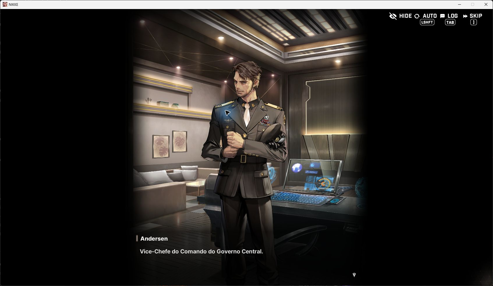
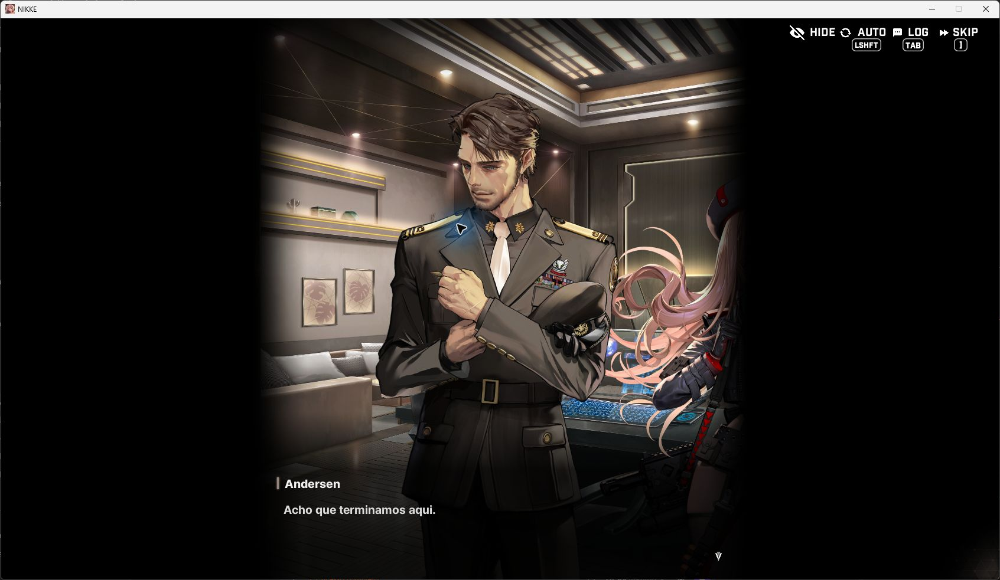

<picture>
  <source media="(prefers-color-scheme: dark)" srcset="./assets/nikke-hero-dark.png" />
  <source media="(prefers-color-scheme: light)" srcset="./assets/nikke-hero-light.png" />
  
</picture>

<h1 align="center">GODDESS OF VICTORY: NIKKE PT-BR / PC</h1>

  <strong>TRADUÇÃO COMUNITÁRIA / BETA / WINDOWS X64</strong>

  <code>v0.1.0 BETA</code>&nbsp;&nbsp;
  <code>CLIENTE 151.8.5</code>&nbsp;&nbsp;
  <code>INSTALADOR GRÁFICO</code>&nbsp;&nbsp;
  <code>REMOÇÃO SEGURA</code>

  <a href="https://github.com/kacksdev/nikke-ptbr/releases/latest"><strong>BAIXAR A VERSÃO ATUAL</strong></a>
  &nbsp;·&nbsp;
  <a href="./docs/INSTALACAO.md">INSTALAR, VERIFICAR, REPARAR OU REMOVER</a>
  &nbsp;·&nbsp;
  <a href="./docs/STATUS.md">VER O ESTADO TÉCNICO</a>

<picture>
  <source media="(prefers-color-scheme: dark)" srcset="./assets/ink-rule-dark.svg" />
  <source media="(prefers-color-scheme: light)" srcset="./assets/ink-rule-light.svg" />
  
</picture>

## 01 / O PROJETO

**NIKKE PT-BR** é uma tradução comunitária gratuita para a versão de PC de GODDESS OF VICTORY: NIKKE. O mod apresenta em português brasileiro os textos conhecidos pelo catálogo sem substituir executáveis, bancos ou arquivos oficiais do cliente.

Esta é uma **beta funcional de ampla cobertura**, não uma revisão editorial integral frase por frase. A base passou por auditorias estruturais, integração real e testes de instalação, mas ainda pode conter literalidade, escolhas contextuais a refinar, pequenas inconsistências ou conteúdo novo em inglês após uma atualização.

> A versão **1.0.0** fica reservada para um estágio editorialmente mais maduro. A revisão integral não possui prazo anunciado e não é confundida com a cobertura técnica desta beta.

O projeto é criado, dirigido, mantido e validado por **Kacks**. Não possui afiliação, patrocínio ou endosso da SHIFT UP, Level Infinite, Proxima Beta ou dos publicadores oficiais.

## 02 / ESTADO ATUAL

| Indicador | Resultado |
| --- | ---: |
| Unidades únicas com base PT-BR | **429.498 / 429.498** |
| Ocorrências conhecidas cobertas | **536.489** |
| Tabelas de origem | **34** |
| Modelos de texto formatado | **2.743** |
| Bloqueios estruturais pendentes | **0** |
| Apontamentos editoriais preservados | **1.689** |
| Pacote transacional | **18/18 verificações** |
| Executável final | **11/11 verificações** |
| Suíte atual do projeto | **116/116 testes** |

Esses números descrevem cobertura e integridade técnica. Eles não significam que 429.498 frases receberam revisão humana individual. Os apontamentos editoriais permanecem registrados para uma etapa futura, sem invalidar o funcionamento da primeira versão.

O pacote atual foi validado no cliente **NIKKE.PC_Official_GL_151.8.5**. A instalação real comprovou carregamento do catálogo, substituições por chave, texto exato e texto formatado, rotas legadas da interface, reparo, remoção e rollback limpo.

## 03 / INSTALAÇÃO RÁPIDA

1. Atualize o NIKKE pelo launcher oficial.
2. Feche completamente o jogo e o launcher.
3. Na [Release mais recente](https://github.com/kacksdev/nikke-ptbr/releases/latest), baixe **`NIKKEPTBRv0.1.0.exe`**.
4. Abra o executável e confirme a pasta detectada. Se necessário, use **ESCOLHER PASTA**.
5. Selecione **INSTALAR TRADUÇÃO** e aguarde a confirmação final.
6. Abra o jogo normalmente pelo launcher oficial.

O mesmo aplicativo permite **verificar, reparar e remover** o mod. Não é necessário abrir terminal ou copiar arquivos manualmente.

> **Não use `Code > Download ZIP` para instalar.** Esse botão baixa o conteúdo do repositório. O instalador pronto fica em **Releases**.

Consulte [Instalação, atualização e remoção](./docs/INSTALACAO.md) para o guia completo.

## 04 / COMO FUNCIONA

A distribuição adiciona somente três componentes próprios ao lado de `nikke.exe`:

- `winhttp.dll`, um encaminhador que preserva as funções da biblioteca do Windows e carrega apenas o runtime fixo do projeto;
- `NIKKEPTBR-Runtime.dll`, responsável por validar o cliente e apresentar traduções;
- `NIKKEPTBR-Runtime.idx`, índice imutável com as correspondências autorizadas.

Antes de permanecer ativo, o runtime confere a identidade do processo, do módulo e de dois pontos necessários do cliente. Uma divergência desativa a tradução e preserva o comportamento original. O projeto não substitui arquivos oficiais, não altera `GameAssembly.dll`, não contorna anticheat e não interfere em autenticação, rede, conta, monetização ou mecânicas.

Veja a [Arquitetura](./docs/ARQUITETURA.md) para os limites e contratos técnicos.

## 05 / VALIDAÇÃO DO INSTALADOR

| Validação | Resultado |
| --- | --- |
| Pacote e contrato transacional | **18 cenários aprovados** |
| Executável final em réplica descartável | **11 cenários aprovados** |
| Instalação, verificação e repetição idempotente | **Aprovadas** |
| Dano controlado e reparo com quarentena | **Aprovados** |
| Colisão com componente desconhecido | **Recusada sem sobrescrita** |
| Falha e retomada de transação | **Rollback e recuperação aprovados** |
| Cliente real | **Runtime e cobertura visível aprovados** |
| Remoção real | **3 arquivos próprios removidos, zero resíduo** |
| Arquivos oficiais | **0 modificado** |
| Reprodutibilidade | **2 construções finais idênticas** |

A carga útil exata da versão final foi aceita no cliente real. O invólucro final foi recompilado depois dessa aceitação apenas para congelar a reprodutibilidade e completar avisos de licenciamento; a identidade do pacote, o bootstrap incorporado e o núcleo do instalador permaneceram idênticos. O executável resultante passou novamente por toda a matriz isolada.

O arquivo ainda não possui certificado comercial de assinatura de código. O Windows pode mostrar **Fornecedor desconhecido** ou o SmartScreen. Baixe somente pelas páginas oficiais e compare o SHA-256 publicado na mesma Release.

## 06 / ATUALIZAÇÕES DO JOGO

O mod não modifica o sistema de atualização do NIKKE. Antes de uma atualização oficial, use **REMOVER TRADUÇÃO**, conclua a atualização pelo launcher e consulte a [matriz de compatibilidade](./docs/COMPATIBILIDADE.md) antes de reinstalar.

Nenhum mod pode prometer compatibilidade absoluta com versões futuras ainda desconhecidas. O instalador recusa clientes não reconhecidos sem gravar o pacote. Conteúdo novo pode permanecer em inglês até uma versão compatível ser preparada.

## 07 / TRADUÇÃO EM JOGO

As imagens abaixo são capturas reais do cliente com a integração PT-BR ativa.

| Identificação de personagem | Diálogo narrativo |
| --- | --- |
|  |  |

## 08 / CONTEÚDO PÚBLICO E VERIFICAÇÃO

| Área | Conteúdo |
| --- | --- |
| [`docs`](./docs) | Arquitetura, compatibilidade, instalação, status, autoria e roadmap. |
| [`assets`](./assets) | Identidade visual e capturas aprovadas para a página do projeto. |
| [`release`](./release) | Manifesto público sem textos nem arquivos proprietários do jogo. |
| [`CHANGELOG.md`](./CHANGELOG.md) | Histórico das versões distribuídas. |

Cada Release inclui o instalador, manifesto JSON e arquivo SHA-256. O repositório não publica bancos extraídos, textos integrais, chaves, executáveis ou outros arquivos proprietários do cliente.

## 09 / AUTORIA E TRANSPARÊNCIA

**NIKKE PT-BR é um projeto criado, dirigido, mantido e validado por mim.** A definição do escopo, do padrão de qualidade, dos testes no cliente, da compatibilidade e da publicação permanece sob minha responsabilidade.

O **OpenAI Codex** foi utilizado como ferramenta auxiliar na tradução em escala, engenharia, automação, auditorias, testes e documentação. A base produzida com auxílio de IA não é apresentada como revisão editorial humana integral.

Os detalhes estão em [Autoria e processo](./docs/AUTORIA-E-PROCESSO.md).

## 10 / RELATOS E DIREITOS

- Erros de tradução, instalação ou compatibilidade podem ser relatados pelas [Issues](https://github.com/kacksdev/nikke-ptbr/issues).
- Vulnerabilidades devem ser enviadas pelo [relato privado de segurança](https://github.com/kacksdev/nikke-ptbr/security/advisories/new).
- GODDESS OF VICTORY: NIKKE, personagens, nomes, artes e demais conteúdos pertencem aos respectivos titulares.
- O mod é gratuito, comunitário e não representa uma tradução oficial.

<picture>
  <source media="(prefers-color-scheme: dark)" srcset="./assets/ink-rule-dark.svg" />
  <source media="(prefers-color-scheme: light)" srcset="./assets/ink-rule-light.svg" />
  
</picture>

<code>KACKS / COMMUNITY TRANSLATION / BRASIL</code>

