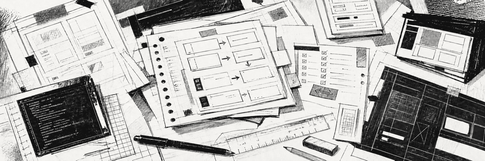
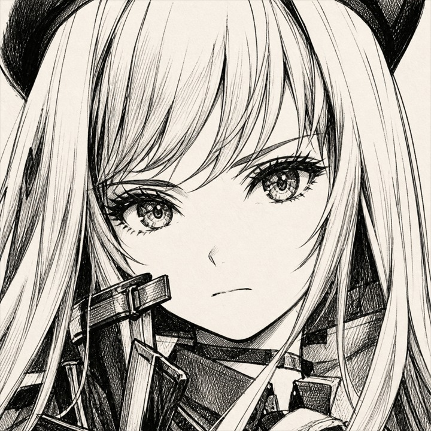

<picture>
  <source media="(prefers-color-scheme: dark)" srcset="./assets/workbench-dark.png" />
  <source media="(prefers-color-scheme: light)" srcset="./assets/workbench-light.png" />
  
</picture>

<h1 align="center">GODDESS OF VICTORY: NIKKE PT-BR / PC</h1>

  <strong>MOD DE LOCALIZAÇÃO / PLANEJAMENTO TÉCNICO / DISTRIBUIÇÃO FECHADA</strong>

  <code>FASE 0</code>&nbsp;&nbsp;
  <code>PREPARAÇÃO TÉCNICA</code>&nbsp;&nbsp;
  <code>SEM BUILD</code>&nbsp;&nbsp;
  <code>PC</code>

<picture>
  <source media="(prefers-color-scheme: dark)" srcset="./assets/ink-rule-dark.svg" />
  <source media="(prefers-color-scheme: light)" srcset="./assets/ink-rule-light.svg" />
  
</picture>

## 01 / O PROJETO

<table>
  <tr>
    <td width="220" align="center">
      <picture>
        <source media="(prefers-color-scheme: dark)" srcset="./assets/nikke-icon-dark.jpg" />
        <source media="(prefers-color-scheme: light)" srcset="./assets/nikke-icon-light.jpg" />
        
      </picture>
    </td>
    <td>
      <strong>LOCALIZAÇÃO COMUNITÁRIA PT-BR POR MODDING</strong>  
      Projeto para traduzir GODDESS OF VICTORY: NIKKE no PC por integração direta com o sistema de localização do cliente, seguindo o mesmo padrão de engenharia, catálogo externo e controle de qualidade aplicado ao Brown Dust 2 PT-BR.  
      O desenvolvimento ainda não começou: não existe plugin, catálogo traduzido, pacote de instalação ou build privada nesta fase.
    </td>
  </tr>
</table>

Este repositório apresenta o estado do projeto, a arquitetura planejada, as ferramentas e o roadmap. **Ele não contém o mod nem arquivos do jogo.** O botão **Code → Download ZIP** baixa somente documentação e imagens.

## 02 / ESTADO ATUAL

| Item | Estado |
| --- | --- |
| Plataforma | **PC / Windows** |
| Fase | **Preparação técnica** |
| Arquitetura-alvo | Plugin Unity em runtime + catálogo PT-BR externo |
| Catálogo de textos | Ainda não criado |
| Tradução | Ainda não iniciada |
| Plugin | Ainda não implementado |
| Build jogável | Não existe |
| Distribuição | Fechada até uma versão suficientemente estável |

O primeiro marco será identificar no cliente instalado o backend Unity, o ponto central de localização, os formatos de texto, os placeholders e a cobertura de fonte. Com esses dados, a implementação definitiva será congelada e versionada.

## 03 / ARQUITETURA PLANEJADA

  <code>MAPEAR CLIENTE</code> →
  <code>LOCALIZAR PIPELINE</code> →
  <code>CRIAR PLUGIN</code> →
  <code>CARREGAR CATÁLOGO</code> →
  <code>COBRIR FONTES</code> →
  <code>AUDITAR</code> →
  <code>TESTAR NO JOGO</code> →
  <code>EMPACOTAR</code>

A arquitetura-alvo é um mod de runtime semelhante ao Brown Dust 2 PT-BR:

1. **Plugin BepInEx em C#** carregado junto ao cliente de PC.
2. **Hook no ponto central de localização**, antes de o texto chegar à interface ou às animações progressivas.
3. **Catálogo PT-BR externo e versionado**, separado dos arquivos proprietários do jogo.
4. **Preservação de IDs, tags, placeholders, variáveis e quebras funcionais**.
5. **Cobertura dos caracteres do português** por fonte ou atlas compatível com a interface Unity/TextMeshPro.
6. **Camadas editoriais auditáveis**, permitindo corrigir traduções sem reconstruir toda a base.
7. **Testes de estabilidade, desempenho e compatibilidade** dentro do cliente antes de cada pacote.

O backend ainda será confirmado. Se o cliente usar IL2CPP, entram Cpp2IL e Il2CppInterop; se usar Mono, o plugin utiliza a rota gerenciada correspondente. Consulte [Arquitetura do mod](./docs/ARQUITETURA.md).

## 04 / FERRAMENTAS DO PROJETO

| Área | Ferramentas planejadas |
| --- | --- |
| Plugin e runtime | C#, .NET, BepInEx, HarmonyX |
| Backend Unity | Cpp2IL e Il2CppInterop para IL2CPP; assemblies gerenciados para Mono |
| Conteúdo Unity | Addressables, AssetRipper, UABEA, UnityPy |
| Catálogo e automação | Python, PowerShell, JSON/JSONL, CSV, regex |
| Interface e fontes | TextMeshPro, atlas de glifos, testes de largura e quebra |
| Versionamento | Git, GitHub, camadas de substituição e hashes |
| Qualidade | Auditores estruturais, logs, testes de regressão, perfil de desempenho e QA in-game |

Essas ferramentas compõem a pilha prevista para o modding. A escolha entre componentes Mono e IL2CPP será feita assim que o backend do cliente for confirmado. Veja [Pilha de ferramentas](./docs/FERRAMENTAS.md).

## 05 / ESCOPO DA LOCALIZAÇÃO

| Conteúdo | Meta |
| --- | --- |
| História principal e eventos | Tradução contextual completa, preservando voz e intenção. |
| Interface e sistemas | Menus, opções, avisos, recompensas e fluxos de jogo. |
| Personagens | Perfis, episódios, diálogos, vínculos e terminologia individual. |
| Combate | Habilidades, efeitos, equipamentos, buffs, debuffs e tutoriais. |
| Itens e coleções | Nomes, descrições, categorias e textos de progressão. |
| Fontes e layout | Acentos corretos, ausência de cortes e legibilidade em todas as resoluções suportadas. |

O catálogo só será considerado completo quando cobertura textual, contexto e funcionamento técnico forem validados em conjunto.

## 06 / AUTORIA E FERRAMENTAS DE APOIO

**NIKKE PT-BR é um projeto criado, dirigido e mantido por mim.** A definição do escopo, as decisões editoriais, a arquitetura final, os testes, o controle de qualidade e a publicação permanecem sob minha responsabilidade.

O **OpenAI Codex** integra o fluxo como ferramenta auxiliar para acelerar documentação, organização técnica, desenvolvimento, tradução assistida e auditorias. Nesta fase, ele auxiliou somente na preparação técnica e documental do projeto: **nenhum texto de NIKKE foi extraído ou traduzido ainda**.

Quando a localização começar, o desenvolvimento seguirá de forma colaborativa: definirei os requisitos, validarei o comportamento no cliente e aprovarei os resultados; o Codex apoiará a execução técnica e editorial em escala. A origem das traduções, o estágio de revisão e as métricas do catálogo serão registrados com clareza. Consulte [Autoria e processo](./docs/AUTORIA-E-PROCESSO.md).

## 07 / PUBLICAÇÃO

- Projeto comunitário para **PC**, gratuito e sem monetização.
- Progresso e documentação públicos; implementação e builds fechados durante o desenvolvimento.
- Nenhum arquivo proprietário do cliente será incluído no repositório ou no pacote do mod.
- Uma futura build deverá ter instalação, remoção, backup, compatibilidade e limitações documentadas.
- NIKKE, personagens, nomes e marcas pertencem aos respectivos titulares.
- O projeto não é afiliado, patrocinado ou endossado pelas empresas responsáveis pelo jogo.

O avanço das fases pode ser acompanhado no [Roadmap](./docs/ROADMAP.md).

<picture>
  <source media="(prefers-color-scheme: dark)" srcset="./assets/ink-rule-dark.svg" />
  <source media="(prefers-color-scheme: light)" srcset="./assets/ink-rule-light.svg" />
  
</picture>

<code>KACKS / COMMUNITY LOCALIZATION / BRASIL</code>

